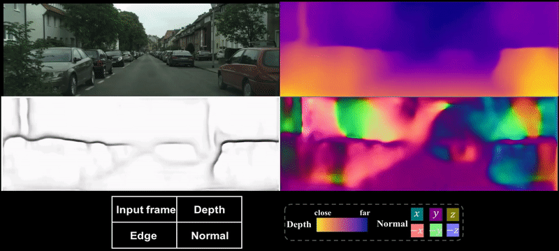

# LEGO

This code reporsitory implements the framework described in the paper [*LEGO: Learning Edge with Geometry all at Once by Watching Videos*](https://arxiv.org/abs/1803.05648) CVPR 2018 (**spotlight**)

Some more information about this paper: [[demo](https://www.youtube.com/watch?v=40-GAgdUwI0)], [[presentation](https://youtu.be/WrEKJeK-Wow?t=4628)], [[poster](misc/cvpr18_poster_lego.pdf)]
<p align="center">

</p>

If you find this work useful, please consider citing this paper
```
@inproceedings{yang2018lego,
  title={LEGO: Learning Edge with Geometry all at Once by Watching Videos},
  author={Yang, Zhenheng and Wang, Peng and Wang, Yang and Xu, Wei and Nevatia, Ram},
  booktitle={Proceedings of the IEEE Conference on Computer Vision and Pattern Recognition},
  pages={225--234},
  year={2018}
}
```

## Prerequisites
This code was developed with Tensorflow 1.0, Python 3.4, CUDA 8.0, cuDNN 5.1 and Ubuntu 14.04.

## Preparing training data
The code takes input data in a certain manner. You can use the scripts in the folder ```data``` to be compatible with the data reading. We used two datasets for training in our experiments.

For [KITTI](http://www.cvlibs.net/datasets/kitti/raw_data.php), first download the dataset using this [script](http://www.cvlibs.net/download.php?file=raw_data_downloader.zip) provided on the official website, and then run the following command
```bash
python3 data/prepare_train_data.py --dataset_dir=/path/to/raw/kitti/dataset/ --dataset_name='kitti_raw_eigen' --dump_root=/path/to/resulting/formatted/data/ --seq_length=3 --img_width=832 --img_height=256 --num_threads=4
```

For [Cityscapes](https://www.cityscapes-dataset.com/), download the following packages: 1) `leftImg8bit_sequence_trainvaltest.zip`, 2) `camera_trainvaltest.zip`. Then run the following command
```bash
python3 data/prepare_train_data.py --dataset_dir=/path/to/cityscapes/dataset/ --dataset_name='cityscapes' --dump_root=/path/to/resulting/formatted/data/ --seq_length=3 --img_width=832 --img_height=342 --num_threads=4
```
As the car logo appears in Cityscapes frames, the bottom part is cropped.

## Training
Once the data is prepared as described above, the training can be started by run the script:
```bash
bash run_train.sh
```
